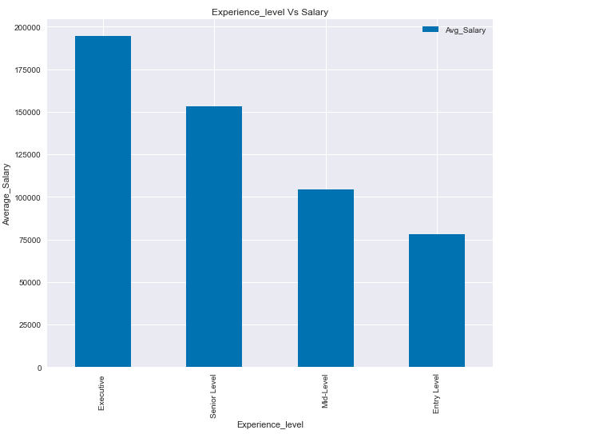

## Data Science Project

### Dataset Coloumn Summary

1. Work_year - The year the salary was paid
2. Experience_level- There are four Categories of experience_level
   ```
   EN-Entry-level
   MI- Mid-level
   SE-Senior-level
   EX-Executive-level
   ```
3. Employment_type - There are four Categories of empolyment_type
   ```
   PT-Part-time
   FT-Full-time
   CT-Contract
   FL-Freelance
   ```
4. Job_title - Job title for the individuals
5. Salary - Total gross amount of salary paid every year
6. Salary_currencey - The currency in which the salary is paid
7. Salary_in_usd - The salary converted to USD by dividing the Salary by the average         Exchange rate
   ```
   Salary in USD = Salary in other currency / Exchange Rate
   ```
8. Employee_residence: The residency of the employees
9. Remote_ratio: It is Categories in three range's
   ```
   0 % - No remote work
   50 % - Partially from home and work
   100 % - Fully Remote
   ```
10. Company_location: The country where the employer's main office 

11. Company_size: The average number of individuals employed by the company      during the year
      ```
      Small - less than 50 employees 
      Medium - 50 to 250 employees 
      Large - more than 250 employees 
      ```

## Part B
### Import Libraries
      import pandas as pd
      import matplotlib.pyplot as plt
      import numpy as np
     
### Fetch the dataset and Convert the excel sheet to CSV File
 ```
Data_Science =pd.read_excel("Data-Science-Project.xlsx",sheet_name ="ds_salaries")
Data_Science.to_csv("Data_Science_Project.csv")

Data_Science.info()    (## To check the class type)
Data_Science.head()    (## To see the few rows of a dataset for quick inspection ) 

```


```
Data_Science["Salary in USD"]=Data_Science["Salary in USD"].astype("int64")   (## Converted the Datatype of int64)

Data_Science.columns    (## To Know the columns name)

Index(['Work_year', 'Experience_level', 'Employment_type', 'Job_title',
       'Salary', 'Salary_currency', 'Salary in USD', 'Employee_residence',
       'Remote_ratio', 'Company_location', 'Company_size',
       'Average Exchange Rate'],
      dtype='object')
```

## Part C
### Data Cleaning Process

```
Data_Science.isna().sum()           (## To check if there is any missing Value)

Work_year                0
Experience_level         0
Employment_type          0
Job_title                0
Salary                   0
Salary_currency          0
Salary in USD            0
Employee_residence       0
Remote_ratio             0
Company_location         0
Company_size             0
Average Exchange Rate    0
dtype: int64

```
#### Droped the Salary and Salary_currency as we have another column with Salary in USD for Analysis Purpose

Data_Science.drop(["Salary","Salary_currency"],axis=1,inplace=True)

```
Data_Science.columns    (##To check the Columns)

Index(['Work_year', 'Experience_level', 'Employment_type', 'Job_title',
       'Salary in USD', 'Employee_residence', 'Remote_ratio',
       'Company_location', 'Company_size', 'Average Exchange Rate'],
      dtype='object')
```

Data_Science.nunique()

```
Work_year                  4
Experience_level           4
Employment_type            4
Job_title                 93
Salary in USD            930
Employee_residence        78
Remote_ratio               3
Company_location          72
Company_size               3
Average Exchange Rate     20
dtype: int64
```
#### Change the Abbrivation to Full Form by using map() function

Data_Science["Employment_type"]=Data_Science["Employment_type"].map ({'PT':"Part-Time","FT":"Full-Time","CT":"Contract","FL":"Freelancer"})


#### To check the duplicates
```
Data_Science.duplicated().sum()
```

#### To check the description of Salary in USD

Data_Science["Salary in USD"].describe()
```
count      3755.000000
mean     137488.435153
std       63136.071320
min        4545.000000
25%       95000.000000
50%      135000.000000
75%      175000.000000
max      450000.000000
Name: Salary in USD, dtype: float64
```
### Styles in Matplotlib
```
plt.style.available

['Solarize_Light2',
 '_classic_test_patch',
 '_mpl-gallery',
 '_mpl-gallery-nogrid',
 'bmh',
 'classic',
 'dark_background',
 'fast',
 'fivethirtyeight',
 'ggplot',
 'grayscale',
 'seaborn',
 'seaborn-bright',
 'seaborn-colorblind',
 'seaborn-dark',
 'seaborn-dark-palette',
 'seaborn-darkgrid',
 'seaborn-deep',
 'seaborn-muted',
 'seaborn-notebook',
 'seaborn-paper',
 'seaborn-pastel',
 'seaborn-poster',
 'seaborn-talk',
 'seaborn-ticks',
 'seaborn-white',
 'seaborn-whitegrid',
 'tableau-colorblind10']
 ```

### Group by 'Work_year' and count the total number of employees
plt.style.use("bmh")
count_by_year = Data_Science.groupby('Work_year').size().reset_index(name='Total_Employees')

#### Plot the bar chart
ab= count_by_year.plot(x='Work_year', y='Total_Employees', kind='bar', legend=True, label=True)


#### Set the title and axis labels

plt.title('Total Number of Employees by Year')

plt.xlabel('Work Year')

plt.ylabel('Total Number of Employees')

ab.bar_label(ab.containers[0])


#### Show the plot
plt.show()


### Group by 'Experience_level' and count the total number of Workers
count_by_year = Data_Science.groupby('Experience_level').size().sort_values().reset_index(name='Total_Employees')

#### Plot the bar chart
ab= count_by_year.plot(x='Experience_level', y='Total_Employees', kind='bar', legend=False)

#### Set the title and axis labels

plt.title('Total Number of Employees by Year')

plt.xlabel('Experience_level')

plt.ylabel('Total Number of Workers')

ab.bar_label(ab.containers[0])

#### Show the plot
plt.show()


### Group by 'Employment_type' and count the total number of Workers
count_by_year = Data_Science.groupby('Employment_type').size().sort_values().reset_index(name='Total_Employees')

#### Plot the bar chart
ab=count_by_year.plot(x='Employment_type', y='Total_Employees', kind='barh')

#### Set the title and axis labels

plt.title('Employment_type')

plt.xlabel('Employment_type')

plt.ylabel('Number of Workers')

ab.bar_label(ab.containers[0])

#### Show the plot
plt.show()


### Group by 'Job_title' and Filter the top 20 Job_title

count_by_job_title = Data_Science.groupby('Job_title').size().sort_values().reset_index(name='Total_Employees')
count_by_job_title

#### Filter top 20 Jobs
top_20_jobs = count_by_job_title.nlargest(20, 'Total_Employees')

#### Plot the bar chart
ab=top_20_jobs.plot(x='Job_title', y='Total_Employees', kind='bar')

#### Set the title and axis labels

plt.title('Top Twenty Jobs as per Survey')

plt.xlabel('Job_titles')

plt.ylabel('Number of Workers')

ab.bar_label(ab.containers[0])

#### Show the plot
plt.show()


### Group by 'Job_title' and MAX Salary per Job_title

count_by_job_title =Data_Science.groupby('Job_title')['Salary in USD'].max().sort_values(ascending = False).reset_index(name='Max_Salary')
count_by_job_title

#### Filter top 10 Maximum Salary
top_10_jobs = count_by_job_title.nlargest(10, 'Max_Salary')

#### Plot the bar chart
ab=top_10_jobs.plot(x='Job_title', y='Max_Salary', kind='bar')

#### Set the title and axis labels

plt.title('Top Ten Highest Paid Job')

plt.xlabel('Job_titles')

plt.ylabel('Maximum Salary')

ab.bar_label(ab.containers[0])

#### Show the plot
plt.show()


### Used crosstab on Work_year and Experience_level

cross_table = pd.crosstab(Data_Science['Work_year'], Data_Science['Experience_level'])

#### Plot the bar graph
ab =cross_table.plot(kind='bar')

#### Created loop for container to add the label in all the bars
for container in ab.containers:
    ab.bar_label(container, fmt='%d', label_type='edge', fontsize=10, color='black', weight='bold')


#### Set the title and axis labels

plt.title('Most Employed')

plt.xlabel('Year')

plt.ylabel('Experience_level')


#### Show the plot
plt.show()

   

   ## Multivariate Analysis

1. ### Which job title earns highest salary ?

   

   ### Top five highest salary earners are  Research Scientist,Data Analyst, Applied Machine Learning Scientist, Principal Data Scientist, Data Scientist

2. ### What is the average salary for each experience level ?

   Avg_salary =Data_Science.groupby('Experience_level')['Salary in USD'].mean().sort_values(ascending = False).reset_index(name='Avg_Salary')

   

   ### Average Salary of Executive's is more than other Experience-level

3. ### What is the average salary for company size Large, Small and Medium ?

   Avg_salary =Data_Science.groupby('Company_size')['Salary in USD'].mean().sort_values(ascending = False).reset_index(name='Avg_Salary')
   ab= Avg_salary.plot(x='Company_size',y='Avg_Salary', kind="bar",legend=True)

   #### Set the title and axis labels
   
   plt.title('Company_size Vs Salary')
   
   plt.xlabel('Company_size')
   
   plt.ylabel('Average_Salary')
   
   ab.bar_label(ab.containers[0])

   

   ### Medium Company employees earns more than Large and Small companies  

4. ### Which job titles are most commonly held by employees in the companies?

   

   ### Data Engineer, Data Scientist and Data Analyst are the top three job titles are most commonly held by employees in the companies

5. ### Which country pays more to the employees ?

   

   ### Top five highest paying countries are Isreal, Puerto Rico ,United State, Russia and Canada

6. ### Which countries provide the greatest number of employment opportunities?

   plt.style.use("dark_background")
   Location_count =Data_Science.groupby('Company_location')['Salary in USD'].count().sort_values(ascending = False).reset_index(name='Highest Jobs')
   Location_count

   #### Filter top 5 Countries with highest jobs
   top_5_countries = Location_count.nlargest(5, 'Highest Jobs')

   #### Plot the bar chart
   ab=top_5_countries.plot(x='Company_location', y='Highest Jobs', kind="bar",legend=True)

   #### Set the title and axis labels

   plt.title('Most Jobs Country Wise ')
   
   plt.xlabel('Company_location')
   
   plt.ylabel('Highest Jobs')
   
   ab.bar_label(ab.containers[0])

   

   ### Top three highest United State, united Kingdom (GB),Canada provide the greatest number of employment opportunities

7. ### Which Job opportunites are more in US as per the Job Title ?

   #### Filter as per location US
   plt.style.use("dark_background")
   Job_title_count = Data_Science[Data_Science["Company_location"] == 'US'].groupby('Job_title').size().sort_values(ascending=False).reset_index(name='Highest Jobs')

   #### Filter Top Most 5 Jobs in US

   top_five_jobs_in_US =Job_title_count.nlargest(5,'Highest Jobs')
   top_five_jobs_in_US

   #### Plot the bar chart
   ab=top_five_jobs_in_US.plot(x='Job_title', y='Highest Jobs', kind="line",legend=True)

   #### Set the title and axis labels

   plt.title('Most Job opportunities Title Wise ')
   
   plt.xlabel('Job_title')
   
   plt.ylabel('Highest Jobs')

   

   ### Top five most Job opportunities in US are Data Enigineer,Data Scientist,Data Analyst, Earning Engineers and Data Architect

8. ### Which is the highest paid Salary in US as per the Job Title ?

   #### Filter as per location US
   plt.style.use("dark_background")
   Max_Sal = Data_Science[Data_Science["Company_location"] == 'US'].groupby('Job_title')['Salary in USD'].max().sort_values(ascending=False).reset_index(name='Highest Salary')

   #### Filter Top Most 5 Jobs in US

   top_ten_jobs_in_US =Max_Sal.nlargest(10,'Highest Salary')
   top_ten_jobs_in_US

   #### Plot the bar chart
   ab=top_ten_jobs_in_US.plot(x='Job_title', y='Highest Salary', kind="bar",legend=True)

   #### Set the title and axis labels

   plt.title('Top Ten Highly Paid Jobs ')
   
   plt.xlabel('Job_title')
   
   plt.ylabel('Maximum Salary')
   
   ab.bar_label(ab.containers[0])
   
   


9. ### What is the trend of data science job roles increased over the passing years ?

   

10. ### What is the trend of salaries paid by companies size over the passing years ?
      ```
      Company_size	      Max_Salary
      Small	            77490.472973
      Large	            117333.077093
      Medium	            143206.871868
      ```
      Analysis on Medium size companies with Average Salary over the years
      ```   
      Work_year      Average_Salary
      2021	         71977.625000
      2020	         105536.875000
      2022	         137297.874027
      2023	         150965.248201
      ```
      

      Analysis on Large size companies with Average Salary over the years

      trend_large_size =Data_Science[Data_Science["Company_size"] == 'Large'].groupby('Work_year')['Salary in USD'].mean().sort_values().reset_index(name='Average_Salary')
      trend_large_size

      #### Plot the bar chart
      trend_large_size.plot(x='Work_year', y='Average_Salary', kind='line')

      #### Set the title and axis labels

      plt.title('Large Size Average Salary')
      
      plt.xlabel('Work_year')
      
      plt.ylabel('Average Salary')

      #### Show the plot
      plt.show()
   

      


